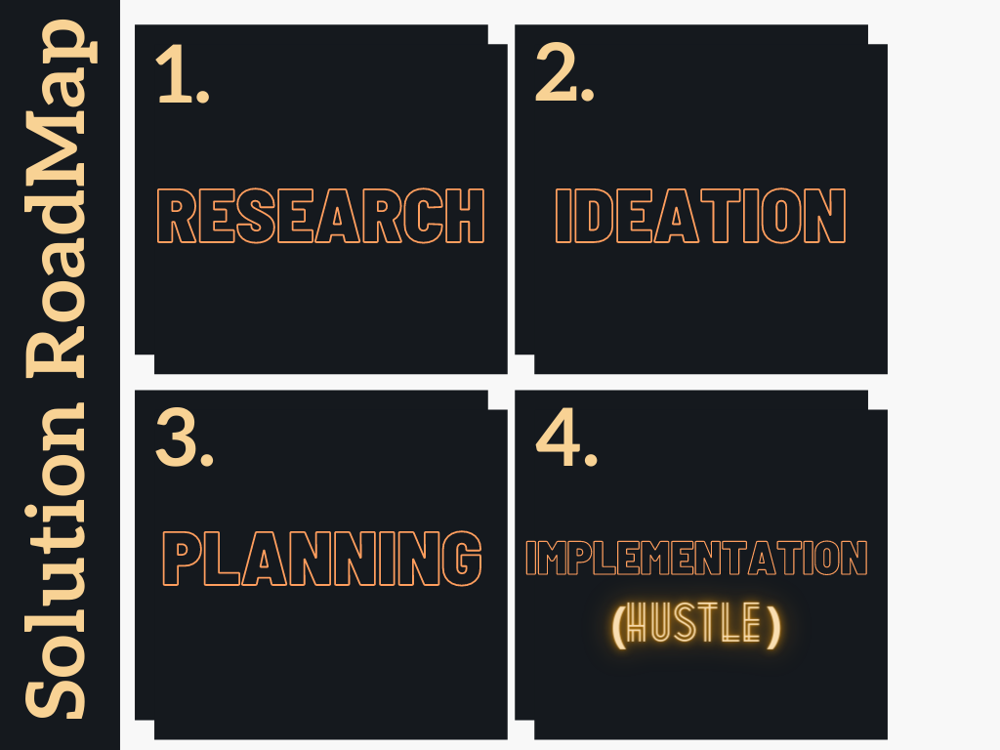

## PROJECT DESCRIPTION
The Problem that we discovered was the waste management of COVID Waste produced all over the world currently. The most effective solution for this is to spread awareness that this waste can be recycled to make bricks, later like foundations for roads or industries. Our Prototype, the website, acknowledges this Problem for a sustainable planet in the future. We provide legitimate resources of awareness about the same. 
Secondly, We also focus on how the process of recycling can be done efficiently. For the same, We provide a platform to the Hospitals to register and donate their waste via us. Next, the Recycling Industries can register themselves to get the notice of COVID waste that can be Recycled. They can order the required items and process them in their industry to make a usable product. We mainly aim for Sustainable Living by these steps, protecting our environment and our Planet Earth in the long run.

## PROJECT ROADMAP

Research 
The moment we learned that we need to develop something concerning Sustainability, we knew it should be related to the Current Pandemic. I was going through IG when I found this video of Abhi and Niyu. It was very informative, and that is where we took inspiration from. We researched more on the same to come up with something solid.

Ideation
In this phase, we say down to develop the exact plan that we would follow according to the time being. We came up with ideas for the solution that we would teach on our website, discussed the same, and note that down on one sheet of paper.

Planning
In this phase, we planned everything in accordance with the time that we have got. We made samples of designs and functionalities so that every member is on the same page. 

Implementation
This is the most crucial phase. We started everything that we have planned. A lot of things were supposed to be done, and time acted as a constraint. But as the team name suggests, We hustled our way till the end of the time provided to us. We didn't give up and kept the work mode on even during the 11th hour.

##LIVE DEMO
[LIVE DEMO LINK HERE](attach link here)
