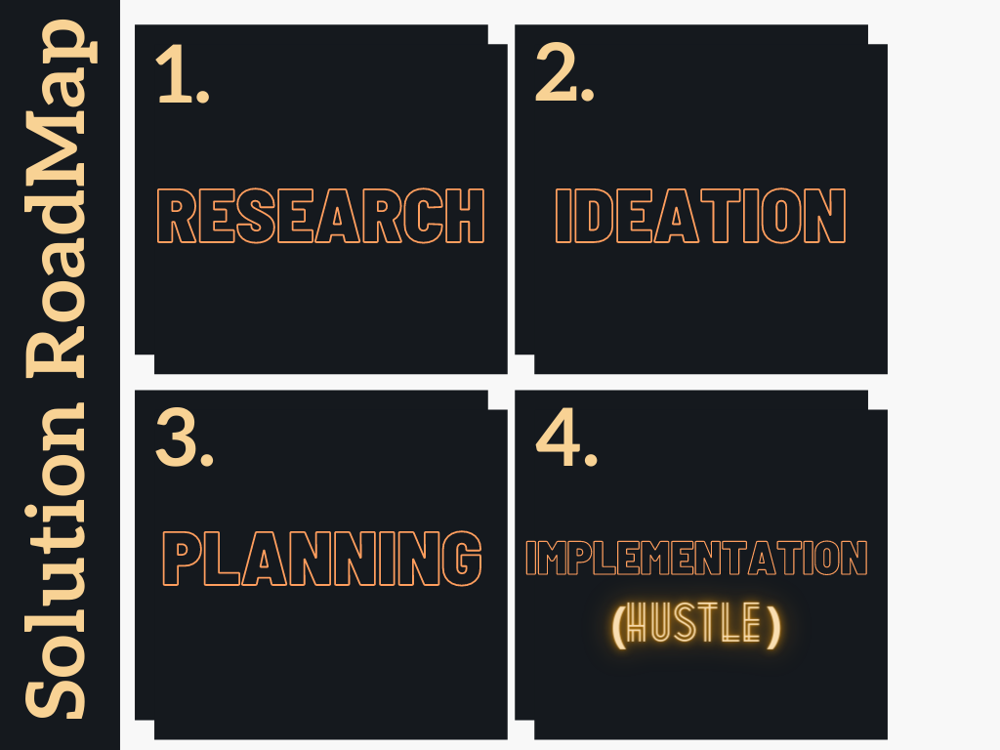

## PROJECT DESCRIPTION
The Problem that we discovered was the waste management of COVID Waste produced all over the world currently. The most effective solution for this is to spread awareness that this waste can be recycled to make bricks, later like foundations for roads or industries. Our Prototype, the website, acknowledges this Problem for a sustainable planet in the future. We provide legitimate resources of awareness about the same. 
Secondly, We also focus on how the process of recycling can be done efficiently. For the same, We provide a platform to the Hospitals to register and donate their waste via us. Next, the Recycling Industries can register themselves to get the notice of COVID waste that can be Recycled. They can order the required items and process them in their industry to make a usable product. We mainly aim for Sustainable Living by these steps, protecting our environment and our Planet Earth in the long run.

## PROJECT ROADMAP

